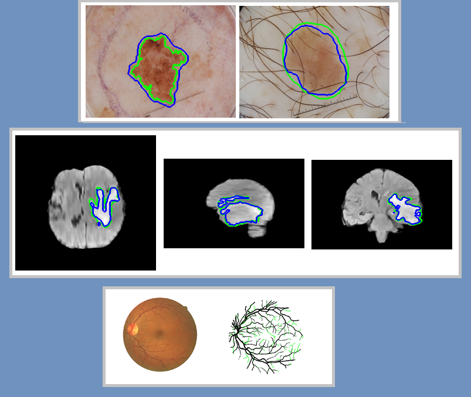

# Biomedical-Image-Segmentation-via-RMSPP-UNet

This project is developed to segment various biomedical imaging applications such as segmentation of brain tumors from MR scans, skin lesions from dermoscopy images, and retinal blood vessels from fundus images.

# Proposed Recurrent Multi-Scale Pyramid Pooling-based U-Net (RMSPP-UNet)

An end-to-end deep learning network called RMSPP-UNET is designed for medical image segmentation. The proposed method is validated with three different medical imaging tasks and performed state-of-the-art performance.

# Python Code

we make the source code publicly available for researchers for validation and further improvement.
The code includes the following files: main, train, predict, and model's network.

# Our Submitted paper

The paper entitled: "Recurrent Multi-Scale Pyramid Pooling Feature Fusion for Efficient Biomedical Image Segmentation" was submitted to a peer-reviewed journal.

When using our code for research publications, please cite our paper.
